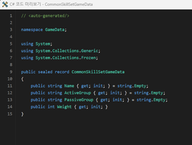
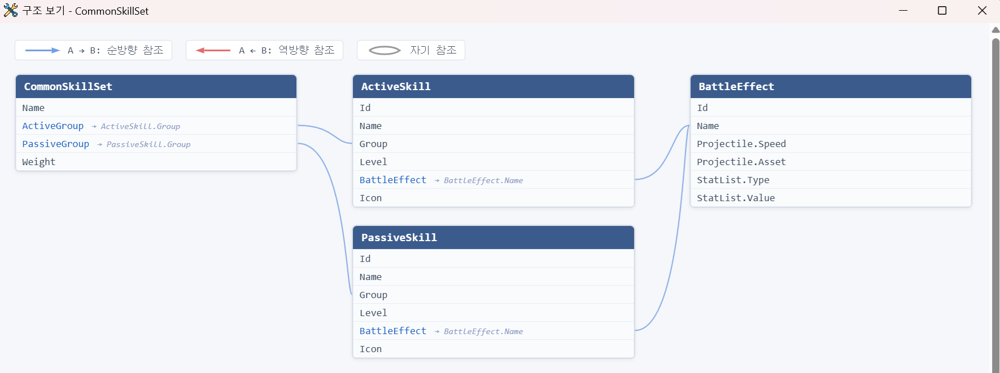
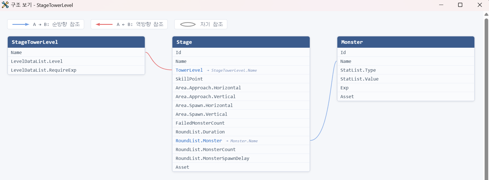

# DatasheetGenerator

게임 데이터를 JSON Schema 기반으로 정의하고, 스키마에 맞춰 데이터를 입력·검증·저장하는 WPF 데스크톱 도구입니다.

---

## Features

- **JSON Schema 생성 및 편집** — 계층 구조(object, array 중첩)를 지원하는 스키마 정의
- **스키마 기반 데이터 입력** — RevoGrid 스프레드시트 UI로 데이터 입력 및 인라인 검증
- **스키마 구조 보기** — 스키마 간 참조 관계를 그래프로 시각화
- **C# 코드 생성 미리보기** — 스키마를 기반으로 C# `sealed record` 코드를 자동 생성하고 파일로 저장
- **Enum 타입 참조** — `enum.schema.json`에 정의된 열거형을 스키마 필드에서 참조
- **다중 포맷 Export** — 내부 JSON, 도메인별 JSON, Excel(.xlsx) 동시 출력

---

## C# Code Generation

스키마를 선택하고 **C# 코드 보기**를 누르면 해당 스키마에 대응하는 C# `sealed record` 클래스를 자동 생성합니다. 생성된 코드는 WebView2 기반 에디터로 미리보고, **저장** 버튼으로 지정된 경로에 파일을 출력합니다.



### 지원 타입

| Schema 타입 | Format | C# 타입 |
|------------|--------|---------|
| `integer` | — | `int` |
| `number` | — | `float` |
| `boolean` | — | `bool` |
| `string` | — | `string` |
| `string` | `datetime` | `DateTime` |
| `integer` | `timespan-hour` / `minute` / `second` / `millisecond` | `TimeSpan` |
| `object` | `vector2` | `Vector2` |
| `object` | `vector3` | `Vector3` |
| `array` | — | `IReadOnlyList<T>` |
| `array` | `frozen-dictionary` | `FrozenDictionary<string, T>` |
| `ref` | `enum.schema.json#/definitions/TypeName` | `EnumTypeName` |

배열 아이템이 object인 경우 중첩 `sealed record`를 함께 생성합니다.  
nullable 필드는 `T?` 형태로 출력됩니다.

---

## Enum Reference

C# enum 파일(`.cs`)을 지정하면 `enum.schema.json`이 자동 생성됩니다. 스키마 필드에서 아래와 같이 enum 타입을 참조합니다.

```json
{
  "EnemyType": {
    "ref": "enum.schema.json#/definitions/MonsterType"
  }
}
```

코드 생성 시 해당 필드는 `public MonsterType EnemyType { get; init; }` 형태로 출력됩니다.  
스키마 구조 보기에서도 `enum` 노드가 연결된 형태로 표시됩니다.

### 통합 ref 형식

스키마 간 참조(cross-schema ref)와 enum 참조 모두 동일한 형식을 사용합니다.

```
"ref": "{SchemaName}.schema.json#/definitions/{ColumnName}"
```

---

## Schema Graph View

스키마 간 참조 관계를 그래프로 시각화합니다. 선택한 스키마를 중심으로 순방향·역방향·자기 참조를 한눈에 확인할 수 있습니다.

**CommonSkillSet** — ActiveSkill, PassiveSkill, BattleEffect 스키마와의 참조 관계



**StageTowerLevel** — Stage, Monster 스키마와의 참조 관계 (역방향 참조 포함)



---

## Export Formats

| Format | 경로 | 설명 |
|--------|------|------|
| 내부 JSON | `%LocalAppData%\DatasheetGenerator\data\` | 앱 내부 저장용 |
| 도메인 JSON | `{OutputRootPath}\{domain}\` | 도메인별 필드 필터링 결과 |
| Excel | `{OutputRootPath}\Excel\` | `.xlsx` 형식 |

---

## Tech Stack

- C# / .NET 10 / WPF
- WebView2 + RevoGrid
- Newtonsoft.Json
- xUnit

<br>
<br>

---
---

## Getting Started

### 1. appsettings.json 설정

`DatasheetGenerator/appsettings.example.json`을 복사하여 같은 경로에 `DatasheetGenerator/appsettings.json`으로 저장한 후 `OutputRootPath`를 실제 출력 경로로 수정합니다.

```json
{
  "OutputRootPath": "C:\\your\\output\\path",
  "Domains": ["json"],
  "CodeOutputPath": "C:\\your\\code\\output\\path",
  "EnumFilePath": "C:\\your\\path\\to\\enum.cs"
}
```

| 키 | 필수 | 설명 |
|----|------|------|
| `OutputRootPath` | ✓ | JSON·Excel·스키마 파일이 출력되는 루트 경로 |
| `Domains` | ✓ | 도메인 이름 목록. 도메인별 서브폴더에 필드 필터링된 JSON을 출력 |
| `CodeOutputPath` | — | C# 코드 생성 파일을 저장할 경로. 비워두면 저장 기능 비활성화 |
| `EnumFilePath` | — | C# enum 소스 파일 경로. 지정 시 `enum.schema.json`을 자동 생성 |

### 2. RevoGrid 파일 준비

RevoGrid 파일은 레포지토리에 포함되어 있지 않습니다.
Node.js가 설치되어 있다면 아래 PowerShell 명령으로 자동 배치할 수 있습니다.

```powershell
$dst = "DatasheetGenerator\wwwroot\revogrid"
npm pack @revolist/revogrid --dry-run 2>$null | Out-Null
$tmp = New-Item -ItemType Directory -Force "$env:TEMP\rg-setup"
Set-Location $tmp
npm install @revolist/revogrid --no-save --silent
New-Item -ItemType Directory -Force "$(git rev-parse --show-toplevel)\DatasheetGenerator\wwwroot\revogrid" | Out-Null
Copy-Item "node_modules\@revolist\revogrid\dist\revo-grid\*" "$(git rev-parse --show-toplevel)\DatasheetGenerator\wwwroot\revogrid" -Recurse -Force
Set-Location -
Remove-Item $tmp -Recurse -Force
```

또는 npm 없이 직접 배치하는 경우, `@revolist/revogrid@4.23.7` 패키지의 `dist/revo-grid/` 디렉토리 내 전체 파일(24개)을 아래 경로에 복사합니다.

```
DatasheetGenerator/wwwroot/revogrid/
```

### 3. 빌드

```powershell
dotnet build DatasheetGenerator.slnx
```

<br>
<br>

---
---

*This project was generated with [Claude Code](https://claude.ai/code).*
